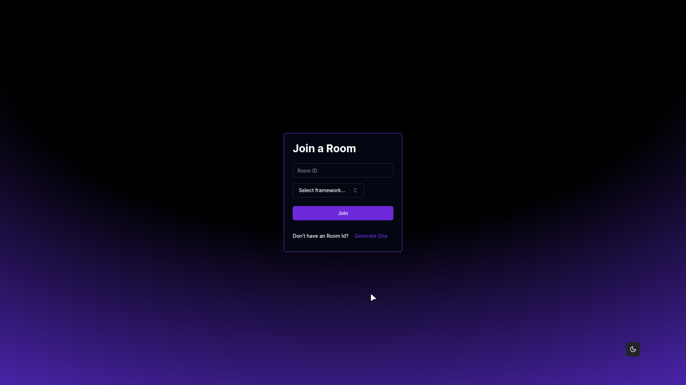
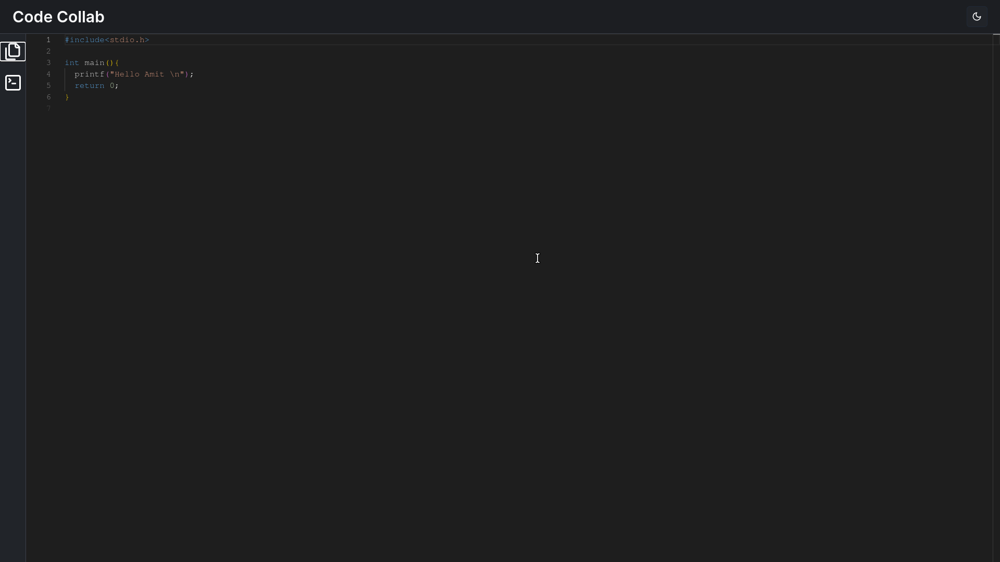
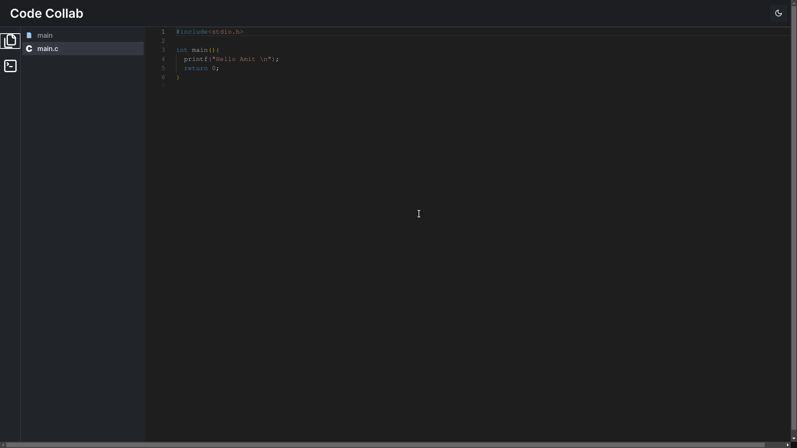
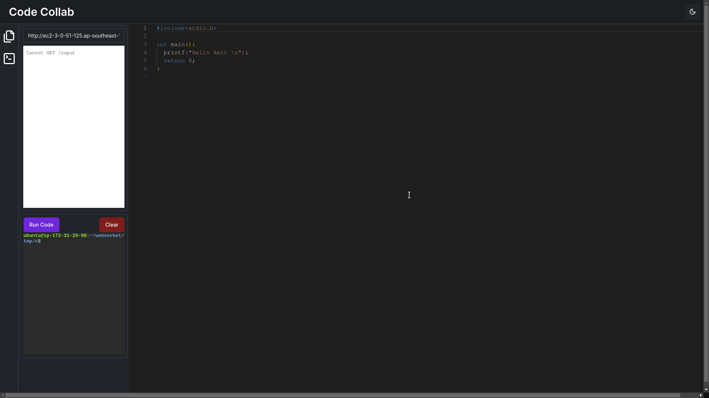

# Code Collab: A Real-Time Collaborative Coding Platform

## Overview
Code Collab is a real-time collaborative coding platform designed to facilitate seamless teamwork among developers. The application is built using Next.js, leveraging modern web technologies and a robust backend to provide an intuitive and efficient coding environment. The platform supports multiple programming languages, including C, C++, Python, Node.js, and React, allowing users to create and join coding sessions in their preferred language.

## Features

### Landing Page
- **Join a Room**: The base route "/" features a Card component where users can enter a room ID and username to join an existing coding session.
- **Create a Room**: Users can create a new room by clicking the "Create one" button, which changes the card's heading to "Create a Room" and provides input fields for room ID, username, and a language selection combobox.

### Room Creation
- **Language Selection**: Users can select from supported languages (C, C++, Python, Node.js, React) to initialize their coding environment.
- **Container Management**: Upon creating a room, a new container is spun up, and the base code is copied from an AWS S3 store to the container using Next.js server actions.

### Editor Page
- **Real-Time Code Collaboration**: The main editor page at "editor/:roomId" is equipped with @monaco-editor/react, enabling real-time code editing.
- **App Bar**: The top app bar includes the title "Code Collab" and a theme toggle button.
- **Sidebar**: 
  - **File Tab**: Contains a basic file tree component allowing users to create and delete files and folders.
  - **Console Tab**: Features an iframe for displaying server output and an xterm terminal component connected to the backend via socket.io and node-pty.

### Collaboration Infrastructure
- **Y.js Integration**: The @monaco-editor/react editor is connected to Y.js using y-monaco and y-socket.io, enabling real-time collaborative editing.
- **File Synchronization**: When a room is created, files from the S3 base/<language> directory are copied to code/<roomId> and transferred to the container. The files are read using the fs module and sent to the client through a socket.io connection.
- **Y.Doc Management**: Each coding session creates a Y.Doc() with the roomId as its name. Each file in the session is represented as a y.Text() in the Y.Doc().

### Tech Stack
- **Frontend**: Next.js, @monaco-editor/react, shadcn/ui, yjs, y-monaco, y-socket.io, TurboRepo
- **Backend**: Node.js, Express, socket.io, node-pty, AWS S3
- **Containerization**: Docker (for container management)
- **Real-Time Collaboration**: Y.js (for real-time data synchronization)

## Getting Started
1. **Clone the repository**: 
    ```bash
    git clone https://github.com/McACE007/Code-Collab.git
    ```
2. **Install dependencies**:
    ```bash
    cd Code-Collab
    npm install
    ```
3. **Set up environment variables**:
   Create a `.env` file in the root directory of and add your configuration details, including AWS S3 credentials and other necessary settings.
4. **Run the development server**:
    ```bash
    npm run dev
    ```
5. **Access the application**:
   Open your browser and navigate to `http://localhost:3000`.

Code Collab aims to provide a robust platform for developers to collaborate in real-time, making coding together as seamless and productive as possible. We look forward to your feedback and contributions to improve the platform further.
 | Join a Room | Editor Page |
|------|-------|
|||

| Editor Page with FileTree  | Editor Page with Console  |
|------|-------|
|||
